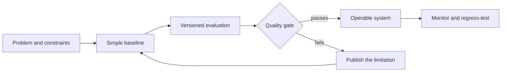

  <picture>
    <source srcset="./assets/header.svg" type="image/svg+xml" />
    
  </picture>

  <a href="https://github.com/RaphaelCerri/wcs-rag-evals">Evaluation-first RAG</a> ·
  <a href="https://github.com/RaphaelCerri/mcp-job-radar">Secure MCP tools</a> ·
  <a href="https://github.com/RaphaelCerri/cognitive-architecture-system">Governed AI systems</a>

I build AI systems that can be **measured, challenged, and operated**, not just demonstrated.
My work sits between applied AI engineering and solutions architecture: retrieval, evaluation,
tool protocols, explicit authority, failure recovery, and the software boundaries around models.

Based in São Paulo, Brazil. Open to remote AI Engineer and AI Solutions Architecture roles.

## Selected engineering work

| Project | What it proves | Evidence |
|---|---|---|
| **[WCS RAG Evals](https://github.com/RaphaelCerri/wcs-rag-evals)** | Evaluation-driven RAG over public warehouse-control documentation | BM25, multilingual embeddings, pgvector, Hybrid RRF, grounded answers, sealed judge protocol, regression gates in CI |
| **[MCP Job Radar](https://github.com/RaphaelCerri/mcp-job-radar)** | A secure, read-only MCP boundary for agent tool use | 4 typed tools, deterministic ranking, prompt-injection defenses, timeout/retry/circuit breaker, 26 tests, 90.57% coverage |
| **[Cognitive Architecture System](https://github.com/RaphaelCerri/cognitive-architecture-system)** | Governed knowledge and multi-role AI workflows | formal ontology experiments, provenance, fairness assurance, role separation, cross-session memory, 248 passing tests |
| **[Job Radar](https://github.com/RaphaelCerri/radar-de-vagas)** | A useful multi-source data pipeline | 6 public job sources, defensive adapters, two-layer relevance filtering, entity deduplication, explainable priority |
| **[Layout Manager](https://github.com/RaphaelCerri/layout-manager)** | Delivery beyond AI demos | Win32 window restoration, multi-monitor coordinates, global hotkey thread, taskbar overlay, Nuitka packaging |

## How I approach AI engineering

- **Evaluation before complexity.** New retrieval, reranking, or generation components must beat a
  recorded baseline. A sophisticated regression is still a regression.
- **Models do not become authorities.** Tool scope, identity, review, and acceptance stay explicit.
- **Failure is a state.** Timeouts, retries, cancellation, partial work, and recovery belong in the
  design rather than in a footnote.
- **Claims follow evidence.** I publish rejected experiments, known gaps, and what a test does not
  prove.

## Technical focus

`Python` · `TypeScript` · `RAG` · `LLM evaluation` · `MCP` · `Pydantic` · `PostgreSQL/pgvector` ·
`BM25 and hybrid retrieval` · `structured outputs` · `AI governance` · `GitHub Actions` · `Docker`

## Current evidence, not vanity metrics

- Hybrid retrieval reached **0.873 Recall@5** and **0.809 nDCG@10** on the versioned WCS set.
- A cross-encoder reranker was rejected after reducing dev nDCG@10 by **0.083**.
- The grounded-answer baseline keeps schema, answerability, and citation-ID validity at **100%**,
  while its low fact coverage remains openly documented.
- The MCP server's CI verifies tool discovery, structured output, typed failures, resilience, and
  adversarial payload handling.
- The cognitive-architecture repository distinguishes executable evidence from experimental and
  planned capabilities instead of presenting one undifferentiated feature list.

## Working with AI assistance

I use AI tools during implementation and review. Architecture, acceptance criteria, trade-offs,
security claims, and published results remain my responsibility. Each major repository states its
assistance boundary and exposes the tests or artifacts behind its claims.

  Reliable AI is not a convincing answer. It is a system that knows what supports the answer, what can fail, and who is allowed to decide.

