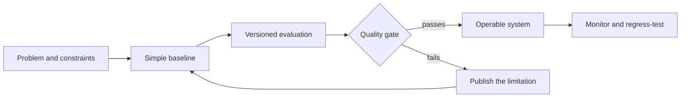

  <picture>
    <source srcset="./assets/header.svg" type="image/svg+xml" />
    
  </picture>

  <a href="https://www.linkedin.com/in/raphael-cerri-caveagna">LinkedIn</a> ·
  <a href="mailto:raphael.cerri@hotmail.com">Email</a> ·
  São Paulo, Brazil · Open to remote roles in Brazil and internationally

I am an **AI Solutions Architect and AI Engineer** with a foundation in backend development and
technical operations. I turn operational bottlenecks into applied AI systems that can be measured,
challenged, and operated, not just demonstrated.

My strongest work sits at the intersection of RAG, agent orchestration, context engineering,
data pipelines, governance, and the deterministic software boundaries around language models.

## Applied impact

The most important systems I have built are internal, so proprietary names and artifacts stay
private. Their outcomes do not:

| Outcome | Engineering context |
|---|---|
| **3 to 5 business days reduced to under 2 hours** | AI-assisted technical specification workflow used across an enterprise project portfolio |
| **~6,600 raw sections transformed into 1,344 curated sections across 33 technical topics** | Python document-mining pipeline with revision resolution, controlled-vocabulary routing, embeddings, semantic clustering, and a quarantine path for uncertain matches |
| **Projected 20% throughput loss limited to under 5% in operation** | Critical workflow audited, redesigned, documented, and defended with enterprise stakeholders |
| **~28 projects per year plus 15 to 20 addenda per month** | Team-adopted documentation lifecycle, with most addenda approved on the first review or resolved on the second |

## What I bring

- **Applied AI architecture:** modular RAG, scoped agents, retrieval gates, context design, model
  integration, cost-aware deterministic processing, and human review boundaries.
- **Production integration:** Anthropic API streaming, token-budget chunking, proactive rate-limit
  control, retries, timeouts, resumable state, and structured downstream contracts.
- **Software foundation:** two years of professional backend development with PHP, Laravel, MySQL,
  REST APIs, webhooks, CRM integrations, Docker, and production troubleshooting across LATAM and EMEA.
- **End-to-end delivery:** Python, TypeScript, React, PostgreSQL, Supabase, desktop automation,
  technical discovery, stakeholder alignment, and product decisions grounded in operational value.
- **Business perspective:** former founder and technical operator of cross-border e-commerce
  businesses in Brazil and Chile, responsible for systems, analytics, catalog operations, and growth.

## Public engineering evidence

| Project | What it proves | Evidence |
|---|---|---|
| **[WCS RAG Evals](https://github.com/RaphaelCerri/wcs-rag-evals)** | Evaluation-driven RAG over public warehouse-control documentation | BM25, multilingual embeddings, pgvector, Hybrid RRF, grounded answers, sealed judge protocol, regression gates in CI |
| **[MCP Job Radar](https://github.com/RaphaelCerri/mcp-job-radar)** | A secure, read-only MCP boundary for agent tool use | 4 typed tools, deterministic ranking, prompt-injection defenses, timeout/retry/circuit breaker, 26 tests, 90.57% coverage |
| **[Cognitive Architecture System](https://github.com/RaphaelCerri/cognitive-architecture-system)** | Governed knowledge and multi-role AI workflows | formal ontology experiments, provenance, fairness assurance, role separation, cross-session memory, 248 passing tests |
| **[Job Radar](https://github.com/RaphaelCerri/radar-de-vagas)** | A useful multi-source data pipeline | 6 public job sources, defensive adapters, two-layer relevance filtering, entity deduplication, explainable priority |
| **[Layout Manager](https://github.com/RaphaelCerri/layout-manager)** | Delivery beyond AI demos | Win32 window restoration, multi-monitor coordinates, global hotkey thread, taskbar overlay, Nuitka packaging |

Selected public results:

- Hybrid retrieval reached **0.873 Recall@5** and **0.809 nDCG@10** on a versioned evaluation set.
- A cross-encoder reranker was rejected after reducing dev nDCG@10 by **0.083**.
- The MCP server verifies structured output, typed failures, resilience, tool annotations, and
  adversarial payload handling in CI.
- Experimental and planned capabilities are labeled separately from executable evidence.

## How I engineer AI systems

- **Evaluation before complexity.** New retrieval, reranking, or generation components must beat a
  recorded baseline. A sophisticated regression is still a regression.
- **Models do not become authorities.** Tool scope, identity, review, and acceptance stay explicit.
- **Failure is a state.** Timeouts, retries, cancellation, partial work, and recovery belong in the
  design rather than in a footnote.
- **Claims follow evidence.** I publish rejected experiments, known gaps, and what a test does not
  prove.

## Technical foundation

**AI engineering:** `RAG` · `LLM evaluation` · `agent orchestration` · `context engineering` ·
`MCP` · `embeddings` · `semantic clustering` · `hybrid retrieval` · `structured outputs`

**Languages and data:** `Python` · `TypeScript` · `PHP` · `SQL` · `PostgreSQL/pgvector` · `MySQL`

**Software and delivery:** `React` · `Laravel` · `Supabase` · `REST APIs` · `Pydantic` · `Docker` ·
`GitHub Actions` · `Win32` · `Nuitka`

## Professional foundation

- **AI Solutions Architect & AI Engineer, 2025 to present:** applied AI systems for engineering
  workflows, knowledge pipelines, agent governance, and enterprise delivery.
- **Backend Web Developer, 2021 to 2023:** production web systems for major brands across LATAM and
  EMEA, including Claro, SemParar, and Sam's Club.
- **Founder & Technical Operator, 2023 to 2025:** two e-commerce operations across Brazil and Chile.
- **B.Sc. in Computer Science, 2026:** Universidade Cruzeiro do Sul.
- Portuguese native, advanced English, and intermediate Spanish.

## AI-assisted development

I use AI tools as implementation accelerators. I define the problem, architecture, acceptance
criteria, and trade-offs; review and challenge generated implementations; and own every security
claim and published result. Each major repository states its assistance boundary and exposes the
tests or artifacts behind its claims.

  Reliable AI is not a convincing answer. It is a system that knows what supports the answer, what can fail, and who is allowed to decide.

